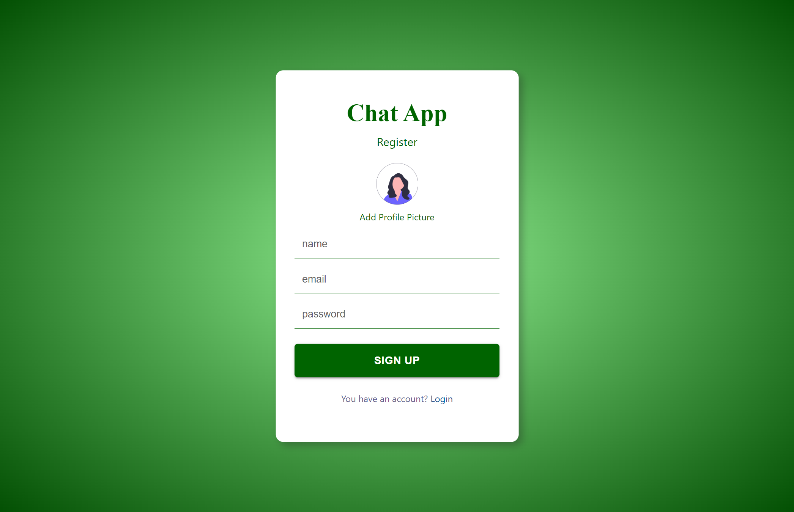
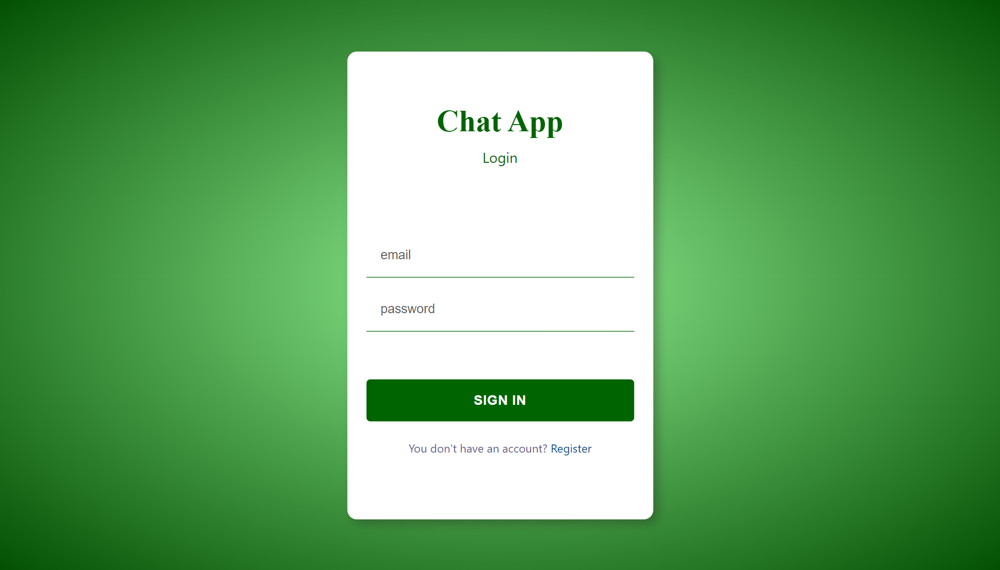
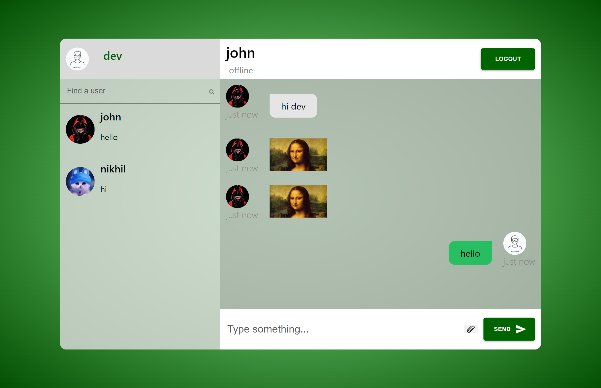

# **CHAT APP**

Chat App is realtime private messaging application made with fully responsive design and compatible with every device. Chat App is bagged with powerful authentication system, beautiful and minimal UI, private chat with users share photos along with messages in chats to enhance the experience.

# Technologies Used
 `CSS`

 `REACT`

 `REACT ROUTER`

 `Firebase`

 `Material UI`
# Features
- Secure Authentication System
- Login and Sign Up Support
- Fully Responsive Design and works on different screen sizes.
- Beautiful and Clean UI
- Private Chat with friends
- Personal Profile Section
- Profile Picture Support
- Users Profile View
- User Online/Offline display support
- Chat with messages and Images
- Share pictures among private chats
- Sign Out/ Logout support
 # Website
 ## Register Page
 
 ## Login Page
 
 ## Chat Page
 
 ## User Setting Page
 
 # Links
 Click [here](https://chat-app-49bee.web.app/login) to run the app.
 
 # Contact
 `https://www.linkedin.com/in/avinash-chandra-12540020b/`
 
 
 `avinashchandrabarik01@gmail.com`
